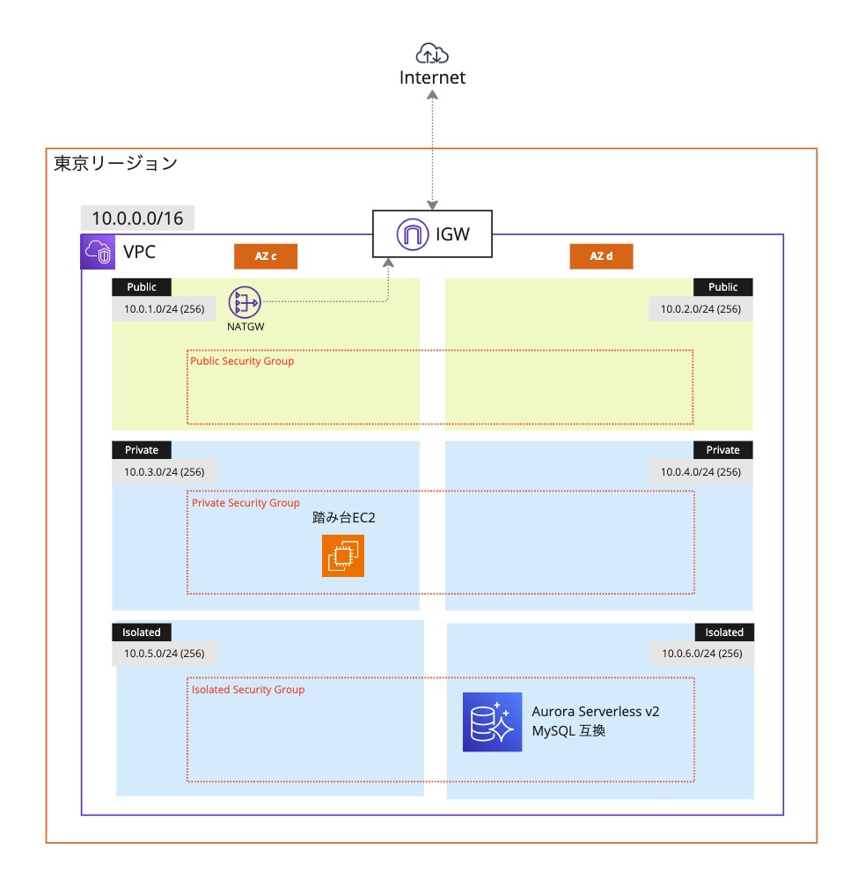

# terraform-template

次の構成を作成する Terraform です



- 主に NAT と Aurora に費用がかかります
- Aurora が不要な場合は`main.tf`で`Database`のブロックをコメントアウトしてください

## 使い方

初期化

```
$ terraform init
```

実行計画の表示

```
$ terraform plan
```

実行

```
$ terraform apply
```

削除

```
$ terraform destroy
```

## tflint に対応しました

install

```sh
% brew install tflint
```

実行（すべてのルールを有効化しています）

```sh
% tflint --recursive --config $(pwd)/.tflint.hcl --format compact
```

参考ページ
[TFLint: Terraform の Linter を活用しよう](https://kakakakakku.hatenablog.com/entry/2023/08/03/133521)
